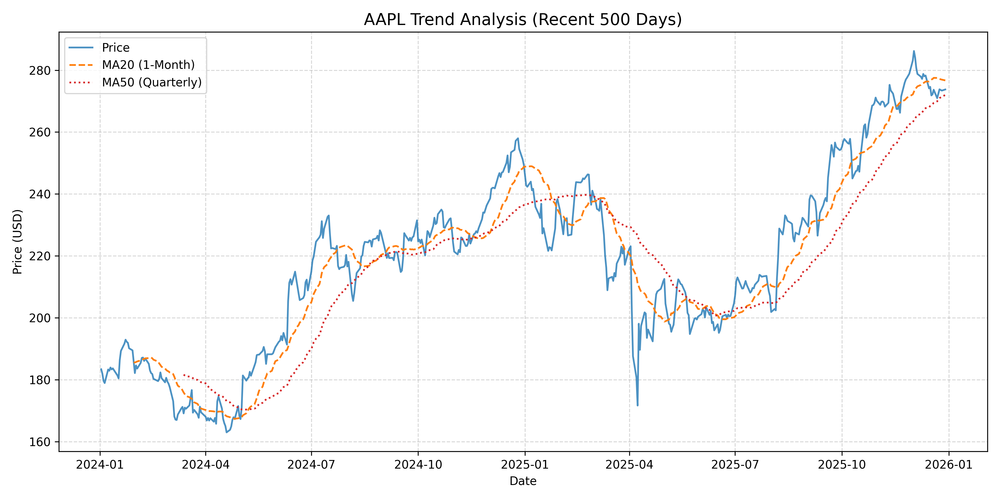

# Quantitative_Finance_Exploration
A simple attempt and practice for beginners in quantitative finance

**Running Process**:
1. py -m venv venv (Create Virtual Environment)
2. .\venv\Scripts\Activate.ps1 (Activate the VE)
3. pip install -r requirements.txt
deactivate (To quit the VE)

Example:

图中的三根线分别代表什么？
- 蓝色实线 (Price)：这是苹果公司的每日收盘价。它反映了市场最即时的情绪波动，跑得最快，也最“乱”。
- 橙色虚线 (MA20)：短期成本线。代表过去一个月买入者的平均成本。如果蓝线掉到橙线下面（如 2025 年 12 月底），说明最近一个月买入的人多数处于亏损状态。
- 红色点线 (MA50)：长期牛熊线。代表一个季度的平均价格。它是股票的“脊梁骨”。只要红线还在往右上方延伸，大方向就还是健康的。

