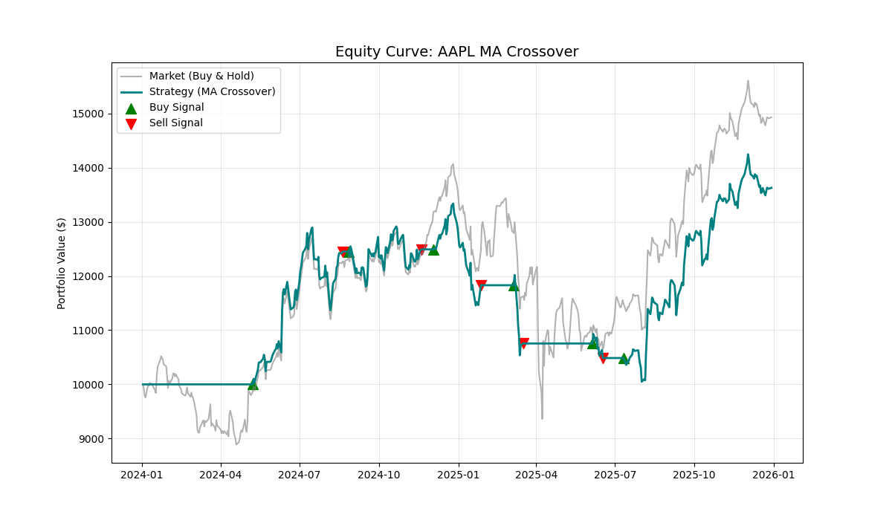
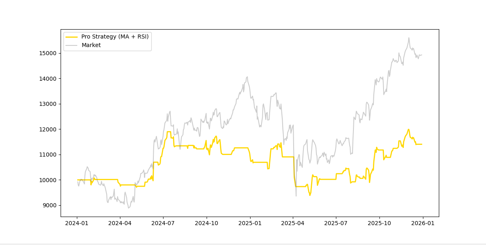

# 量化策略研究日志 (Research Log)

## Commit df570b9 策略概览
- **策略名称**: 双均线交叉策略 (Dual Moving Average Crossover)
- **参数设定**: 
  - 短周期均线 (Fast MA): 20日
  - 长周期均线 (Slow MA): 50日
- **回测标的**: AAPL (Apple Inc.)
- **回测周期**: 最近 500 个交易日 (约 2024年初 - 2025年底)
- **初始资金**: $10,000.00

## 绩效表现
| 指标 | 表现 |
| :--- | :--- |
| **策略最终价值** | ~$13,600 |
| **策略累计收益率** | +36% |
| **基准收益率 (Buy & Hold)** | +50% |
| **结果对比** | **未击败基准 (Underperformed)** |

## 图示

## 策略评估

### ✅ 优点
- **风险对冲能力**: 在 2024 年初以及部分市场明显回调阶段，策略成功触发了卖出信号，资金曲线表现平稳，有效规避了回撤。
- **趋势跟踪**: 在 2024 年 5 月至年底的大牛市中，能够稳定持仓，抓住了主要上涨波段。

### ❌ 缺点
- **信号滞后性**: 均线交叉属于滞后指标，在趋势反转初期无法第一时间入场，损失了部分启动阶段的利润。
- **震荡市磨损 (Whipsaw)**: 在 2025 年中期的横盘震荡行情中，均线频繁发生无效交叉，导致多次“高买低卖”，产生了显著的交易成本摩擦和利润回撤。

## 结论与后续计划
**结论**: 初始版本的 20/50 均线策略在 AAPL 这种强趋势股票上的表现不如直接长期持有。

**后续优化方向**:
1. **参数调优**: 尝试更灵敏的组合（如 10/30）以减少滞后性，或更迟钝的组合以过滤震荡。
2. **引入辅助过滤**: 增加成交量 (Volume) 或 RSI 指标，在市场震荡、成交量萎缩时减少操作。
3. **多标的验证**: 将策略应用于 NVDA 或 TSLA 等不同波动特性的股票进行交叉验证。

---

## 策略优化记录 02 - Pro 模式
- **参数**: 10/20 (MA) + RSI (14)
- **收益**: 14.05%
- **核心优化**: 引入了 RSI < 70 的买入限制。
- **优点**: 
  1. 交易频率大幅下降，有效保护了由于频繁手续费带来的磨损。
  2. 资金曲线回撤（Drawdown）显著减小，持仓体验更舒适。
- **痛点**: 在强单边牛市（如 2025 年末）中，RSI 可能会过早判定为“超买”，导致我们卖早了，没吃到最后那口肉。
- 
